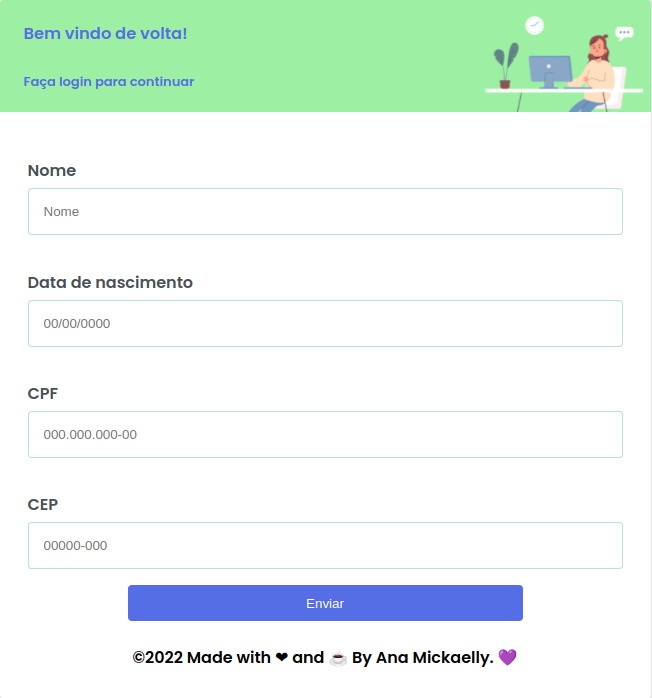
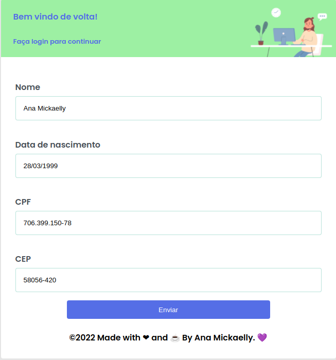

<h1 align="center">
    <a href="#">Form React</a>
</h1>
<p align="center">🚀 Address selection platform developing by react, Typescript and styled components.
</p>
<p align="center">
  
  
  
  
</p>

### Deploy and how to access the application

- [Here](https://form-react-test.vercel.app/)





### 🛠 Technology

The following tools were used in the construction of the project:

- [React](https://pt-br.reactjs.org/)
- [TypeScript](https://www.typescriptlang.org/)
- [Styled Components](https://styled-components.com/)
- [React Router Dom](https://v5.reactrouter.com/web/guides/quick-start)

### Getting Started 🚀

#### Cloning

```ps
# Clone the repository using git
$ git clone https://github.com/AnaMickaelly/form-react.git

# Access the project folder
$ cd form-react
```

#### Requirements

- [Node.js](https://nodejs.org/en/)
- [Yarn](https://yarnpkg.com/) or [npm](https://www.npmjs.com/)

This project use third party dependencies that need to be installed, use that command to install all needed dependencies

```ps
$ yarn install
or
$ npm i
```

#### Running

To start the Server run the command

```ps
# Entering in directory
$ cd form-react

# Run the server
$ yarn dev
or
$ npm run dev
```

### License 📝

This project is under the MIT license. See the [LICENSE](https://github.com/AnaMickaelly/form-react/blob/master/LICENSE) for more information.
